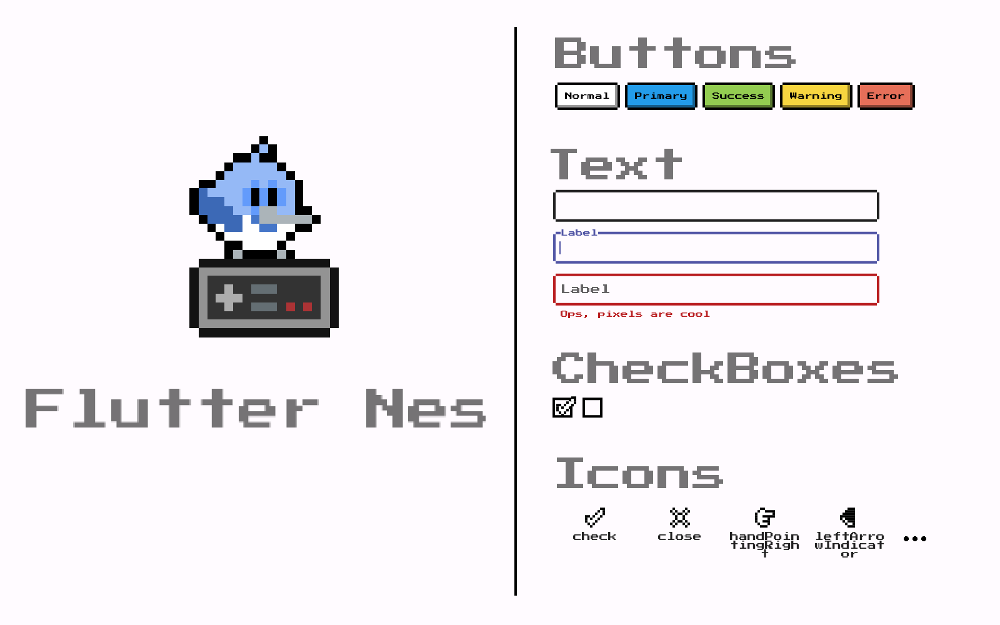

# Nes

[![style: very good analysis][very_good_analysis_badge]][very_good_analysis_link]
[](https://github.com/felangel/mason)
[![License: MIT][license_badge]][license_link]



UI library inspired by old retro video game console

## Installation 💻

**❗ In order to start using Nes UI you must have the [Flutter SDK][flutter_install_link] installed on your machine.**

Add `nes_ui` to your `pubspec.yaml`:

```yaml
dependencies:
  nes_ui:
```

Install it:

```sh
flutter packages get
```

---

## Configure it

Nes UI provides a `ThemeData` that you can add to your `MaterialApp`, that theme can be obtained
from the `flutterNesTheme` method:

```dart
import 'package:nes_ui/nes_ui.dart';

MaterialApp(
  theme: flutterNesTheme(),
);
````

Check the many arguments on the method to customize the theme.

## Font

Nes UI uses the [Press start 2P](https://fonts.google.com/specimen/Press+Start+2P)
from the [Google Fonts package](https://pub.dev/packages/google_fonts).

Google fonts will fetch the files in runtime over http. To keep that behaviour and unsure that it works,
be sure to call `WidgetsFlutterBinding.ensureInitialized();` at your main method.

For more info on that follow this [Google Fonts package guide](https://pub.dev/packages/google_fonts#http-fetching).

If instead you want to bundle the fonts in the app and avoid http requests,
follow [this other guide](https://pub.dev/packages/google_fonts#font-bundling-in-assets).


You also should include the font license on `LicenseRegistry` when bundling it on the app.

For example:

```dart
void main() {
  LicenseRegistry.addLicense(() async* {
    final license = await rootBundle.loadString('google_fonts/OFL.txt');
    yield LicenseEntryWithLineBreaks(['google_fonts'], license);
  });

  runApp(...);
}
```

More about font license [here](https://pub.dev/packages/google_fonts#licensing-fonts).

Check the gallery of all widgets [here](https://erickzanardo.github.io/flutter_nes/#/).

## Material Customized Widgets

Nes UI trives to use the most out of material that it can, customizing their looks to fit
the package desired look, here is the list of widgets from Material that are customized by
Nes UI

 - Text
 - TextField/TextFormField
 - Divider

## Custom Widgets

Some widgets are too different from the Material look and structure, which was not possible to
achieve without building the whole widget from scratch, this is the list of widgets that Nes UI
provides:

 - NesButton
 - NesCheckbox
 - NesContainer
 - NesIcon

More to come!

[flutter_install_link]: https://docs.flutter.dev/get-started/install
[github_actions_link]: https://docs.github.com/en/actions/learn-github-actions
[license_badge]: https://img.shields.io/badge/license-MIT-blue.svg
[license_link]: https://opensource.org/licenses/MIT
[logo_black]: https://raw.githubusercontent.com/VGVentures/very_good_brand/main/styles/README/vgv_logo_black.png#gh-light-mode-only
[logo_white]: https://raw.githubusercontent.com/VGVentures/very_good_brand/main/styles/README/vgv_logo_white.png#gh-dark-mode-only
[mason_link]: https://github.com/felangel/mason
[very_good_analysis_badge]: https://img.shields.io/badge/style-very_good_analysis-B22C89.svg
[very_good_analysis_link]: https://pub.dev/packages/very_good_analysis
[very_good_cli_link]: https://pub.dev/packages/very_good_cli
[very_good_coverage_link]: https://github.com/marketplace/actions/very-good-coverage
[very_good_ventures_link]: https://verygood.ventures
[very_good_ventures_link_light]: https://verygood.ventures#gh-light-mode-only
[very_good_ventures_link_dark]: https://verygood.ventures#gh-dark-mode-only
[very_good_workflows_link]: https://github.com/VeryGoodOpenSource/very_good_workflows<D-b>
