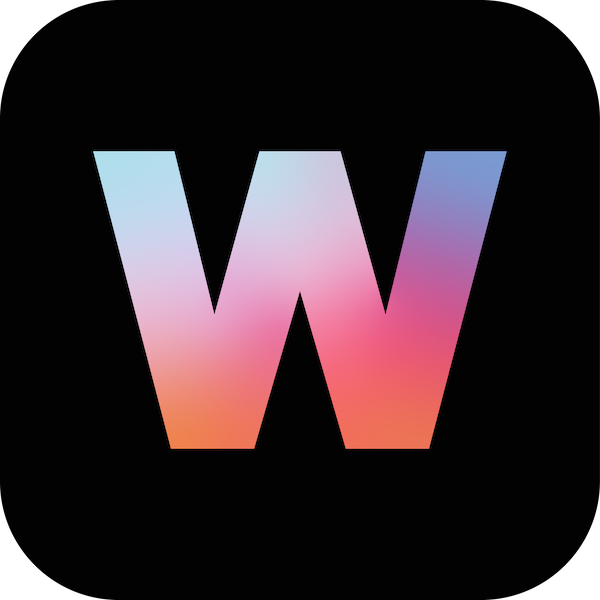

# Nes

[![style: very good analysis][very_good_analysis_badge]][very_good_analysis_link]
[](https://github.com/felangel/mason)
[![License: MIT][license_badge]][license_link]


UI library inspired by old retro video game console


## Installation 💻

**❗ In order to start using Nes UI you must have the [Flutter SDK][flutter_install_link] installed on your machine.**

Add `nes_ui` to your `pubspec.yaml`:

```yaml
dependencies:
  nes_ui:
```

Install it:

```sh
flutter packages get
```

---

## Configure it

Nes UI provides a `ThemeData` that you can add to your `MaterialApp`, that theme can be obtained
from the `flutterNesTheme` method:

```dart
import 'package:nes_ui/nes_ui.dart';

MaterialApp(
  theme: flutterNesTheme(),
);
````

Check the many arguments on the method to customize the theme.

## Font

Nes UI uses the [Press start 2P](https://fonts.google.com/specimen/Press+Start+2P)
from the [Google Fonts package](https://pub.dev/packages/google_fonts).

Google fonts will fetch the files in runtime over http. To keep that behaviour and ensure that it works,
be sure to call `WidgetsFlutterBinding.ensureInitialized();` at your main method.

For more info on that follow this [Google Fonts package guide](https://pub.dev/packages/google_fonts#http-fetching).

If instead you want to bundle the fonts in the app and avoid http requests,
follow [this other guide](https://pub.dev/packages/google_fonts#font-bundling-in-assets).


You also should include the font license on `LicenseRegistry` when bundling it on the app.

For example:

```dart
void main() {
  LicenseRegistry.addLicense(() async* {
    final license = await rootBundle.loadString('google_fonts/OFL.txt');
    yield LicenseEntryWithLineBreaks(['google_fonts'], license);
  });

  runApp(...);
}
```

More about font license [here](https://pub.dev/packages/google_fonts#licensing-fonts).

## Widget gallery

Find all the widgets in this [catalog](https://nes-ui.pages.dev/) made on [Widgetbook](https://www.widgetbook.io/).



## Getting help

If you need any help or have suggestions, join our [Discord](https://discord.gg/7GHtgtDMtJ).

## Material Customized Widgets

Nes UI tries to use the most out of material that it can, customizing its looks to fit
the package's desired look, for example, here is a list of some of the widgets that Nes ui customizes:

 - Text
 - TextField/TextFormField
 - Divider
 - ...

## Custom Widgets

Some widgets are too different from the Material look and structure, making the customization of the material widget not really possible, so many widgets are built from scratch, here is a list of some of the widgets that Nes UI
provides:

 - NesButton
 - NesCheckbox
 - NesContainer
 - NesConfirmDialog
 - NesIcon
 - NesSelectionList
 - NesIterableOptions
 - ...

## Custom Extension

Nes UI is built taking advantage of the Theme Extensions and custom extensions can also be provided.
In order to provide your own extension, you need to create it, and provide it to the `flutterNesTheme`:

```dart
    theme: flutterNesTheme(
      brightness: state.lightMode ? Brightness.light : Brightness.dark,
      customExtensions: [
        CustomExampleExtension.light, // Your custom extension goes here.
      ],
    ),

```

For more information, look at the example code.

[Support this project 💙](https://cherrybit.studio/about-supporting/)

[flutter_install_link]: https://docs.flutter.dev/get-started/install
[github_actions_link]: https://docs.github.com/en/actions/learn-github-actions
[license_badge]: https://img.shields.io/badge/license-MIT-blue.svg
[license_link]: https://opensource.org/licenses/MIT
[logo_black]: https://raw.githubusercontent.com/VGVentures/very_good_brand/main/styles/README/vgv_logo_black.png#gh-light-mode-only
[logo_white]: https://raw.githubusercontent.com/VGVentures/very_good_brand/main/styles/README/vgv_logo_white.png#gh-dark-mode-only
[mason_link]: https://github.com/felangel/mason
[very_good_analysis_badge]: https://img.shields.io/badge/style-very_good_analysis-B22C89.svg
[very_good_analysis_link]: https://pub.dev/packages/very_good_analysis
[very_good_cli_link]: https://pub.dev/packages/very_good_cli
[very_good_coverage_link]: https://github.com/marketplace/actions/very-good-coverage
[very_good_ventures_link]: https://verygood.ventures
[very_good_ventures_link_light]: https://verygood.ventures#gh-light-mode-only
[very_good_ventures_link_dark]: https://verygood.ventures#gh-dark-mode-only
[very_good_workflows_link]: https://github.com/VeryGoodOpenSource/very_good_workflows<D-b>
